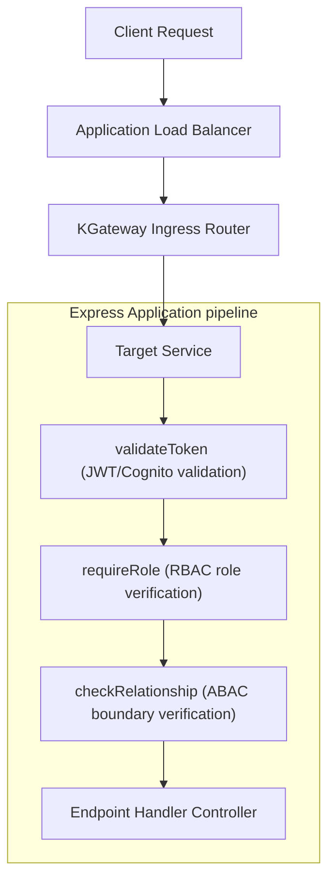
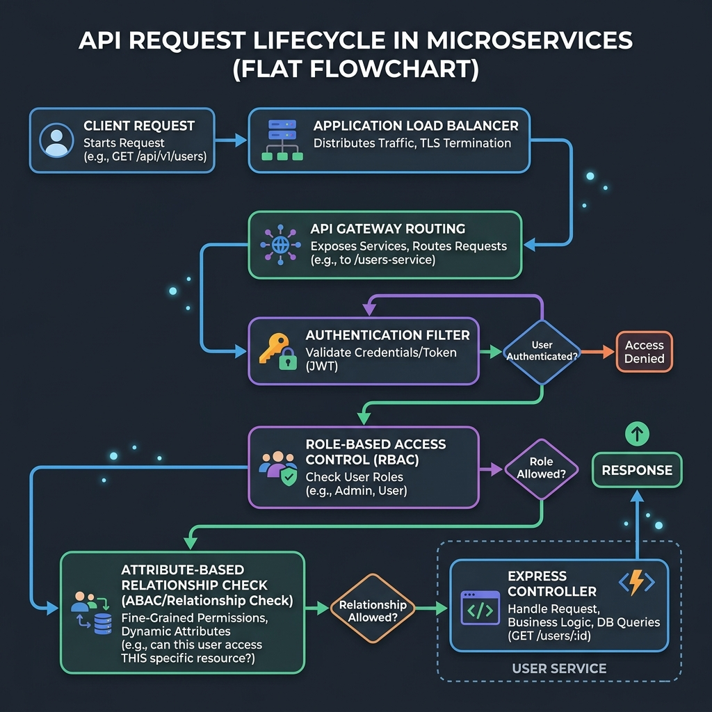

# API Endpoints Reference 🔌

This document provides a consolidated catalog of key endpoints exposed across the ElderPing microservices ecosystem. All backend services respond with JSON payloads.

---

## API Request Lifecycle Flow

Below is the execution path of a request passing through the infrastructure routing layers and Express security filters before reaching the controller logic.



#### Visual API Request Lifecycle Flowchart:


---

## 1. Authentication Service (`auth-service` :3001)

Authentication endpoints handle user creation, token issuance, and caregiver-to-elder relationship mappings.

| Method | Endpoint | Authorization | Description |
| :--- | :--- | :--- | :--- |
| **POST** | `/register` | Public | Registers a new user. |
| **POST** | `/login` | Public | Authenticates credentials and returns a JWT token. |
| **GET** | `/me` | Bearer Token | Decodes token payload to return the authenticated user record. |
| **POST** | `/links` | Bearer Token (ADMIN+) | Links a `FAMILY` caregiver to an `ELDER` user. |
| **GET** | `/links/verify/:familyId/:elderId` | Bearer Token | Verifies if a relationship link exists in `users_db`. |

### Login Example
**Request:**
```http
POST /login HTTP/1.1
Host: api.elderping.online
Content-Type: application/json

{
  "username": "grandma",
  "password": "password123"
}
```
**Response (200 OK):**
```json
{
  "token": "eyJhbGciOiJIUzI1NiIsInR5cCI6IkpXVCJ9...",
  "user": {
    "userId": "1002",
    "username": "grandma",
    "role": "ELDER",
    "email": "grandma@elderping.com"
  }
}
```

---

## 2. Health Tracker Service (`health-service` :3002)

Manages real-time patient metrics and daily physical check-ins.

| Method | Endpoint | Authorization | Description |
| :--- | :--- | :--- | :--- |
| **POST** | `/checkin` | Bearer Token (ELDER) | Logs a daily presence check-in for the elder. |
| **POST** | `/vitals` | Bearer Token (ELDER) | Logs vitals (heart rate, blood pressure, oxygen). |
| **GET** | `/vitals/:userId` | Bearer Token (ABAC) | Retrieves vital logs history for a specific elder. |

---

## 3. Medication Reminder Service (`reminder-service` :3003)

Schedules medication rules and tracks taking compliance.

| Method | Endpoint | Authorization | Description |
| :--- | :--- | :--- | :--- |
| **POST** | `/reminders` | Bearer Token (ADMIN+) | Creates a new medication tracking schedule. |
| **GET** | `/reminders/:userId` | Bearer Token (ABAC) | Lists active medication schedules. |
| **PUT** | `/reminders/:id/take` | Bearer Token (ELDER) | Marks a medication dose as TAKEN. |
| **GET** | `/reminders/:userId/compliance` | Bearer Token (ABAC) | Calculates taken/missed statistics for reporting. |

---

## 4. Alert Logging Service (`alert-service` :3004)

Logs emergency issues, abnormal vitals, and system flags.

| Method | Endpoint | Authorization | Description |
| :--- | :--- | :--- | :--- |
| **POST** | `/alerts` | Bearer Token | Appends a system alert to `alert_db`. |
| **GET** | `/alerts` | Bearer Token (ADMIN+) | Gets the 50 most recent global system alerts. |
| **GET** | `/alerts/user/:userId` | Bearer Token (ABAC) | Retrieves active alerts flagged for a specific elder. |
| **PUT** | `/alerts/:id/resolve` | Bearer Token (ADMIN+) | Marks a system alert as resolved. |

---

## 5. Intelligent AI Service (`ai-service` :3000)

Invokes Amazon Bedrock to support healthcare Q&A, voice analysis, and risk scoring.

| Method | Endpoint | Authorization | Description |
| :--- | :--- | :--- | :--- |
| **POST** | `/ai/query` | Bearer Token (ABAC) | general medical Q&A or symptom queries. |
| **POST** | `/ai/voice-checkin` | Bearer Token (ABAC) | Processes transcribed voice check-in text. |
| **POST** | `/ai/finops-recs` | Bearer Token (ADMIN+) | Processes cost profiles and extracts saving tips. |
| **GET** | `/ai/interactions` | Bearer Token (SUPER+) | Audits the history of Bedrock model calls. |

### Voice Check-in Example
**Request:**
```http
POST /ai/voice-checkin HTTP/1.1
Host: api.elderping.online
Content-Type: application/json
Authorization: Bearer <Token>

{
  "userId": "1002",
  "transcribedText": "I feel a bit lightheaded today and my leg is sore after walking in the garden."
}
```
**Response (200 OK):**
```json
{
  "summary": "AI Generated Voice Check-in Summary: The patient experienced lightheadedness and leg soreness following outdoor activity.",
  "createdNote": {
    "id": 482,
    "user_id": "1002",
    "note_type": "AI_NOTE",
    "content": "AI Generated Voice Check-in Summary: The patient experienced lightheadedness and leg soreness following outdoor activity."
  }
}
```

---

## 6. Reports Generation Service (`report-service` :3000)

Aggregates stats, invokes AI analysis, and saves weekly files to S3.

| Method | Endpoint | Authorization | Description |
| :--- | :--- | :--- | :--- |
| **POST** | `/reports/generate` | Bearer Token (ABAC) | Runs weekly aggregation and uploads JSON to S3. |
| **GET** | `/reports/user/:elderId` | Bearer Token (ABAC) | Lists report indexes registered in PostgreSQL. |
| **GET** | `/reports/:id/download` | Bearer Token (ABAC) | Generates access URL for S3 report object. |

---

## 7. Notification Dispatcher (`notification-service` :3000)

Manages dispatching and queues via SES/SNS.

| Method | Endpoint | Authorization | Description |
| :--- | :--- | :--- | :--- |
| **POST** | `/notifications/trigger` | Bearer Token | Dispatches a direct notification (checked against preferences). |
| **GET** | `/notifications/logs` | Bearer Token (ADMIN+) | Returns email/SMS delivery logs and failure audits. |
| **GET** | `/notifications/preferences/:userId` | Bearer Token (ABAC) | Retrieves user notification preference fields. |
| **PUT** | `/notifications/preferences/:userId` | Bearer Token (ABAC) | Updates preference checklist states. |

---

## 8. Audit Logging Service (`audit-service` :3000)

Stores auditable records of administrative actions.

| Method | Endpoint | Authorization | Description |
| :--- | :--- | :--- | :--- |
| **POST** | `/audit` | Bearer Token | Records administrative actions and state changes. |
| **GET** | `/audit` | Bearer Token (SUPER+) | Fetches global audit trail log rows. |

---

## 9. Cost Optimization Service (`finops-service` :3000)

Extracts cloud billing statistics and tracks infrastructure optimization.

| Method | Endpoint | Authorization | Description |
| :--- | :--- | :--- | :--- |
| **GET** | `/finops/dashboard` | Bearer Token (SUPER+) | Fetches AWS Cost Explorer service breakdown. |
| **GET** | `/finops/recommendations` | Bearer Token (SUPER+) | Fetches or triggers Bedrock cost advisor recommendations. |
