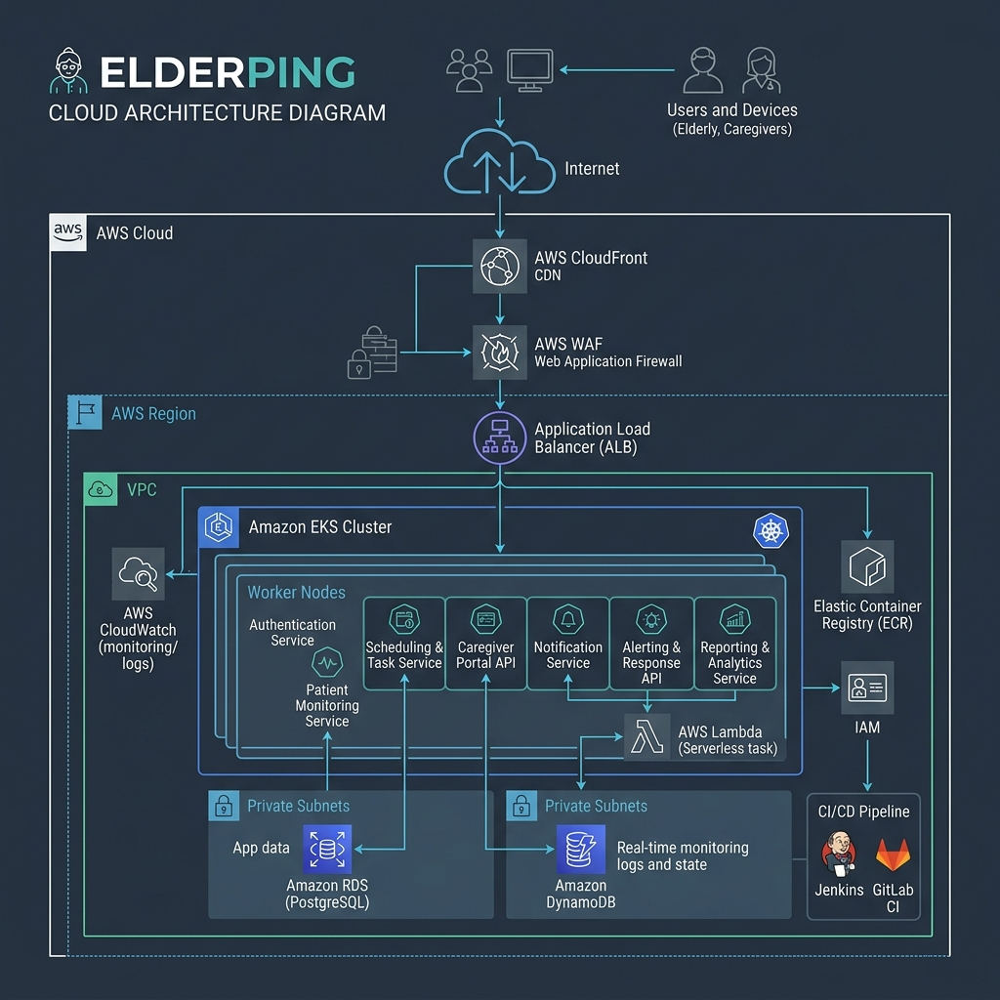
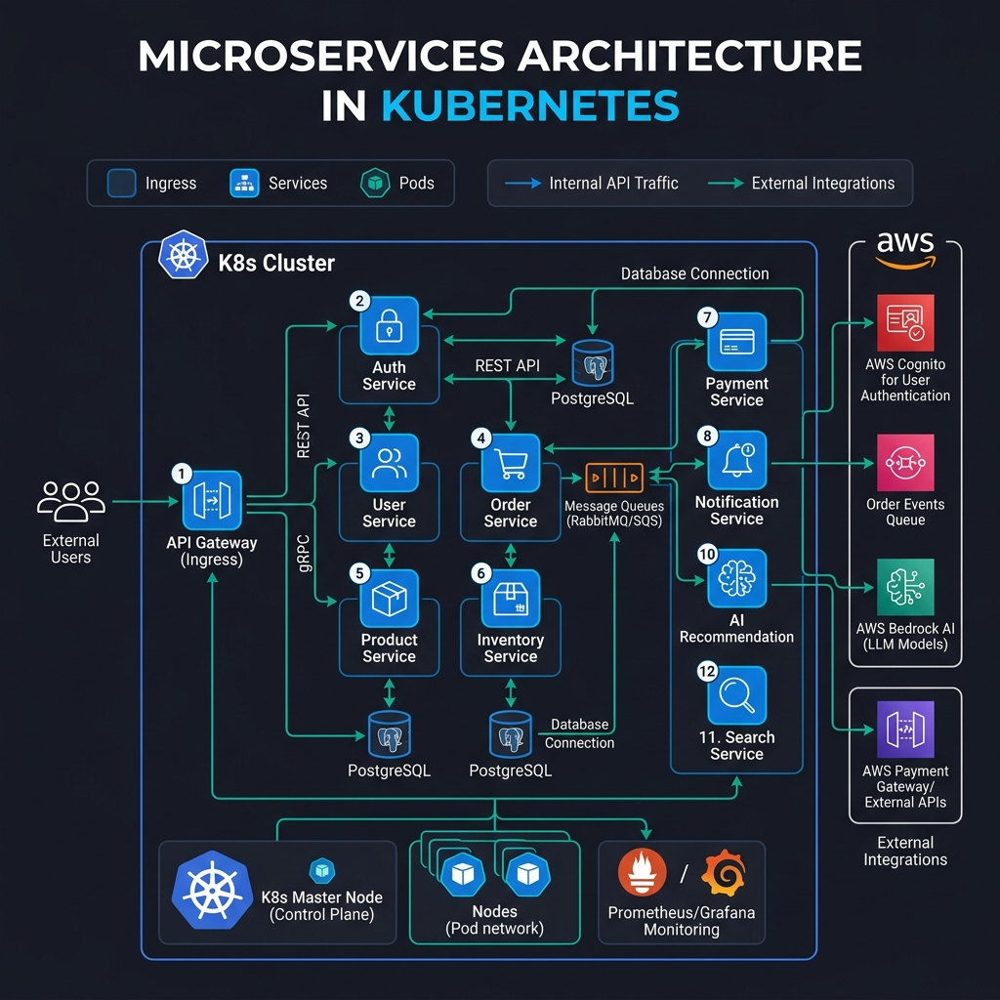

# System Architecture 🏗️

ElderPing is structured as a decoupled, specialized microservices application. Each service runs in its own container, encapsulates a distinct business domain, owns its database schema, and communicates with other services using either synchronous REST API calls or asynchronous event messaging.

---

## 1. Request Routing Flow Diagram

The diagram below outlines how client requests originating from the public internet pass through Route 53 DNS records, are distributed via CloudFront (for static assets) or the Application Load Balancer (for dynamic APIs protected by WAFv2), and are ultimately routed into the Amazon EKS cluster via **KGateway** (an Envoy-based Gateway API implementation).

> [!NOTE]
> **Diagram Format**: This documentation uses **Mermaid.js** blocks (dynamic text-based flowcharts) that render automatically on GitHub, VS Code (by pressing `Ctrl+Shift+V`), or online markdown readers. A static high-fidelity fallback image is also embedded below.

```mermaid
graph TD
    Client["Client / User Browser"] -->|UI Assets (HTTPS)| CF["AWS CloudFront CDN"]
    CF -->|Origin Fetch| S3["Amazon S3 UI Bucket"]
    
    Client -->|API Requests (HTTPS)| API_DNS["api.elderping.online (Route 53)"]
    API_DNS --> ALB["AWS Application Load Balancer"]
    ALB -->|Inspected by| WAF["AWS WAFv2 Web ACL"]
    ALB -->|Forward to NodePort| KG["KGateway (Envoy Proxy)"]
    
    subgraph EKS["Amazon EKS Cluster (healthcare Namespace)"]
        KG -->|Route /api/auth/*| Auth["auth-service"]
        KG -->|Route /api/health/*| Health["health-service"]
        KG -->|Route /api/reminder/*| Reminder["reminder-service"]
        KG -->|Route /api/alert/*| Alert["alert-service"]
        KG -->|Route /api/ai/*| AI["ai-service"]
        KG -->|Route /api/report/*| Report["report-service"]
        KG -->|Route /api/appointment/*| Appt["appointment-service"]
        KG -->|Route /api/notes/*| Notes["notes-service"]
        KG -->|Route /api/notification/*| Notif["notification-service"]
        KG -->|Route /api/audit/*| Audit["audit-service"]
        KG -->|Route /api/finops/*| FinOps["finops-service"]
        KG -->|Route /| UI["ui-service (Nginx Frontend Static Router)"]
    end
```

#### Visual Architecture Diagram (Request Routing):


---

## 2. Microservice Dependency & Integration Flow Diagram

This diagram displays the integration points between individual microservices, their dedicated database instances, and external AWS resources via AWS SDK wrappers (Cognito, Bedrock, Cost Explorer, SQS, SES, SNS, and S3).

```mermaid
graph TD
    subgraph DBs["Isolated Databases (RDS PostgreSQL)"]
        db_auth["users_db"]
        db_health["health_db"]
        db_reminder["reminder_db"]
        db_alert["alert_db"]
        db_appt["appointment_db"]
        db_notes["notes_db"]
        db_ai["ai_db"]
        db_report["report_db"]
        db_notif["notification_db"]
        db_audit["audit_db"]
        db_finops["finops_db"]
    end

    subgraph ServiceMesh["EKS Healthcare Pods"]
        Auth["auth-service"] --> db_auth
        Health["health-service"] --> db_health
        Reminder["reminder-service"] --> db_reminder
        Alert["alert-service"] --> db_alert
        Appt["appointment-service"] --> db_appt
        Notes["notes-service"] --> db_notes
        AI["ai-service"] --> db_ai
        Report["report-service"] --> db_report
        Notif["notification-service"] --> db_notif
        Audit["audit-service"] --> db_audit
        FinOps["finops-service"] --> db_finops
        
        Report -->|Fetch Vitals (REST)| Health
        Report -->|Fetch Compliance (REST)| Reminder
        Report -->|Fetch Appointments (REST)| Appt
        Report -->|Fetch Alerts (REST)| Alert
        Report -->|Analyze Risk (REST)| AI
        Report -->|Trigger Report Email (REST)| Notif
        
        AI -->|Generate Voice Note (REST)| Notes
        
        FinOps -->|AI Insights (REST)| AI
        
        AllServices["All Services"] -.->|Audit Log Requests (REST)| Audit
    end

    subgraph AWSCloud["AWS Integrations"]
        Report -->|Store PDF/JSON reports| S3_Rep["S3 Reports Bucket"]
        AI -->|Invoke Model (SDK)| Bedrock["Amazon Bedrock (Claude 3)"]
        FinOps -->|Get Billing Metrics (SDK)| CE["AWS Cost Explorer"]
        Notif -->|Send Email (SDK)| SES["Amazon SES"]
        Notif -->|Send SMS (SDK)| SNS["Amazon SNS"]
        SQS["Amazon SQS Queue"] -->|Poll Notifications| Notif
        EB["Amazon EventBridge"] -->|Publish Scheduler Events| SQS
        Appt -->|Trigger Scheduler Events| EB
    end
```

#### Visual Architecture Diagram (Microservice Communication):


---

## 3. Microservice Roles & Responsibilities

The system consists of **12 microservices**:

1. **`ui-service`**: React SPA (Vite + Tailwind CSS). It serves as the primary dashboard for elders (logging vitals and compliance) and family members (viewing dashboards, notes, weekly summaries). Served via Nginx with custom routing configuration.
2. **`auth-service`**: Handles user authentication, registration, password hashing (local mode), role profiles (`ELDER`, `FAMILY`, `ADMIN`, `SUPER_ADMIN`), and linking family accounts to elders (`family_links` table). Connects to AWS Cognito in cloud deployments.
3. **`health-service`**: Tracks patient vitals (heart rate, blood pressure, oxygen levels) and check-in logs. 
4. **`reminder-service`**: Handles medication configurations, daily schedules, and tracks medication compliance (marking doses as `TAKEN` or `MISSED`).
5. **`alert-service`**: Gathers system and patient alerts (e.g., missed medications, abnormal vitals, sensor issues) for logging and operator investigation.
6. **`ai-service`**: The intelligent assistant wrapper. Interfaces with **Amazon Bedrock** (Claude 3 Haiku) to support user queries (symptom checks, health Q&A), summarizes voice-to-text check-ins, performs patient risk evaluations, and generates cost-reduction recommendations.
7. **`appointment-service`**: Manages doctor appointments, scheduling details, and clinic records. Triggers reminders through notifications.
8. **`notes-service`**: Supports caregivers and family members in writing care notes, comments, and flags for patients. 
9. **`report-service`**: Orchestrates data aggregation. Gathers metrics from health, reminder, appointment, and alert services, sends them to `ai-service` for risk assessment, formats a comprehensive report, uploads the JSON metadata to **Amazon S3**, and calls `notification-service` to alert the caregiver.
10. **`notification-service`**: Dispatches system updates. Incorporates **AWS SES** for emails, **AWS SNS** for SMS, and polls an **AWS SQS** queue to handle asynchronous scheduling alerts dispatched from EventBridge. Includes user notification preference filters.
11. **`audit-service`**: Provides compliance audit trails. Collects structured logs from other services when administrative operations are performed (IP address, resource ID, before/after states, and action types).
12. **`finops-service`**: Tracks AWS costs. Integrates with **AWS Cost Explorer** to fetch monthly infrastructure charges (EKS, RDS, Bedrock, S3, CloudWatch) and coordinates with `ai-service` to recommend instance scaling and workload consolidation strategies.

---

## 4. Database-per-Service Architectural Pattern

Each service has a dedicated schema to enforce domain boundaries and prevent database-level coupling:

| Database Instance | Owner Service | Key Entities/Tables | Primary Database Actions |
| :--- | :--- | :--- | :--- |
| `users_db` | `auth-service` | `users`, `family_links` | Registration, credential checks, relationship verification. |
| `health_db` | `health-service` | `vitals_logs`, `checkin_logs` | Vital logs entry, liveness checks. |
| `reminder_db` | `reminder-service` | `reminders`, `compliance_logs` | Medication CRUD, compliance auditing. |
| `alert_db` | `alert-service` | `alerts` | Event alert logging and resolution flags. |
| `appointment_db`| `appointment-service`| `appointments`, `doctors` | Schedule management, reschedule tracking. |
| `notes_db` | `notes-service` | `notes` | Text notes entry, search index storage. |
| `ai_db` | `ai-service` | `ai_interactions` | Prompts, Bedrock token usage, execution cost audits. |
| `report_db` | `report-service` | `weekly_reports` | Compliance score logs, S3 object keys, risk scoring. |
| `notification_db`| `notification-service`| `notification_preferences`, `notification_logs` | Email/SMS logging, dispatcher filters. |
| `audit_db` | `audit-service` | `audit_logs` | Structured admin change trackers (actor ID, IP, diff states). |
| `finops_db` | `finops-service` | `finops_daily_costs`, `finops_recommendations` | Cost history tracking, applied recommendation states. |

> [!IMPORTANT]
> **Data Integrity Constraint:**
> Under no circumstances does a microservice query a database owned by another service directly. In circumstances where cross-domain data is needed (e.g. `report-service` gathering telemetry for a patient), it must make REST API requests to the owner services using the caller's JWT token for authorization.
