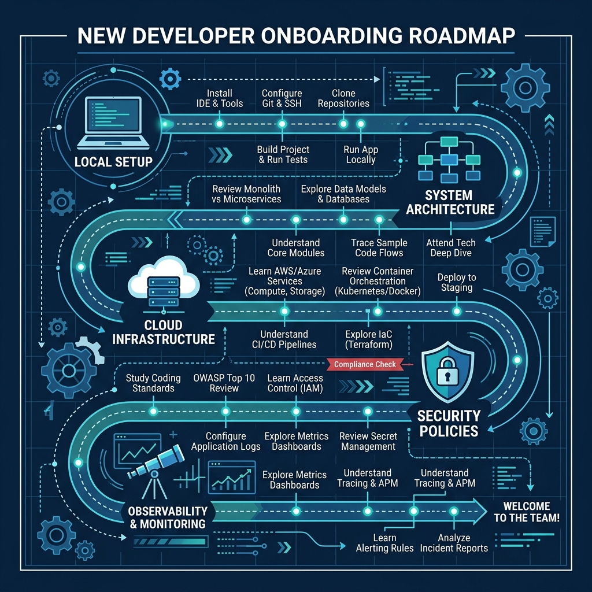

# ElderPing Documentation Suite 🩺

Welcome to the official technical documentation suite for **ElderPing** (formerly ElderPinq). 

ElderPing is a production-grade, enterprise-ready healthcare platform designed to support elderly individuals and their care circles (family members, doctors, and system administrators). It is implemented as a highly decoupled microservices architecture deployed to Amazon Web Services (AWS) using Kubernetes (Amazon EKS) and orchestrated via modern GitOps practices (ArgoCD).

---

## Technical Overview

ElderPing serves as an end-to-end demonstration of a modern, secure, and observable cloud-native application. The platform balances high availability, granular access control, real-time alerting, and Cost-Aware Infrastructure (FinOps) powered by generative AI.

### Core Stack
* **Frontend**: React SPA built with Vite, styled with Tailwind CSS, and served via Nginx.
* **Backend**: Express (Node.js) REST microservices.
* **Databases**: PostgreSQL (Multi-AZ in AWS, StatefulSets in local k8s).
* **AWS Integrations**: EKS Cluster, Cognito, Bedrock (Claude 3 Haiku), SES, SNS, SQS, Cost Explorer, Route 53, CloudFront, WAFv2.
* **GitOps & Deployment**: ArgoCD App-of-Apps, Helm, KGateway (Envoy-based Gateway API), HAProxy.
* **Observability**: Prometheus, Grafana, Loki, AWS CloudWatch.

---

## Documentation Navigation

This documentation is split into logical modules covering application components, cloud deployments, security policies, and performance tuning. 

> [!NOTE]
> All guides feature dual-format diagrams: **Mermaid.js dynamic blocks** for interactive IDE/browser rendering, and **static image fallbacks** for raw text editors.

| Document | Description | Key Focus Areas |
| :--- | :--- | :--- |
| 🚀 [Developer Onboarding Guide](onboarding.md) | Freshers startup & local development onboarding guide. | Workstation setup, Docker seed scripts, coding a new feature. |
| 🏗️ [Architecture Overview](architecture.md) | High-level system design and microservice map. | Communication patterns, DB schema, flow diagrams. |
| ☁️ [AWS Infrastructure (Terraform)](infrastructure.md) | Infrastructure-as-code deployment guide. | VPC topology, RDS, Cognito, ECR, Route 53, CDN. |
| ☸️ [Kubernetes & GitOps](kubernetes.md) | Cluster setup, ingress routing, and GitOps pipelines. | Gateway API, NFS volumes, HAProxy, ArgoCD. |
| 🛡️ [Security & Compliance](security.md) | Identity management, RBAC/ABAC, and threat protection. | Cognito JWKS, family links (ABAC), GuardDuty, WAF. |
| 📊 [Observability & FinOps](observability.md) | Monitoring setup and cloud cost optimization. | Prometheus, Grafana, Loki, Cost Explorer, Bedrock. |
| 🔌 [API Endpoints Reference](api-reference.md) | Consolidated API documentation for all services. | Request/response payloads, auth scopes, errors. |

#### Documentation Structure Map:


---

> [!TIP]
> **Getting Started Quick-Tip:**
> For local testing, you can spin up the core platform using Docker Compose at the root of the project:
> ```bash
> cp .env.example .env
> docker compose up --build -d
> ```
> Visit [http://localhost:8080](http://localhost:8080) to interact with the UI, and register users using the `auth-service` API. Detailed coding walkthroughs can be found in the [Developer Onboarding Guide](onboarding.md).
