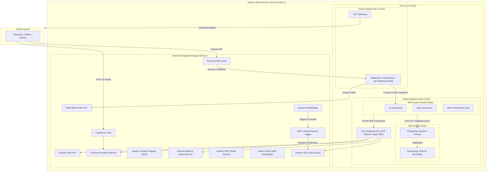
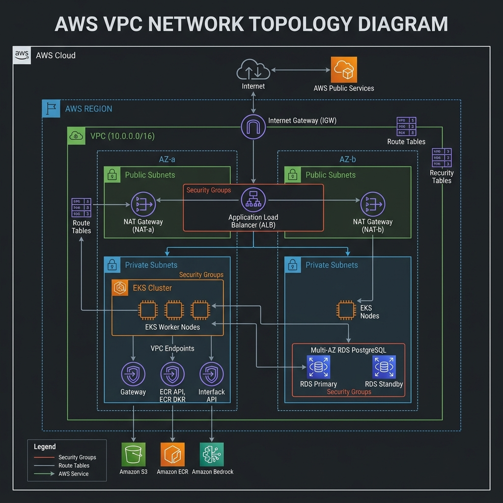

# Cloud Infrastructure & Terraform Guide ☁️

ElderPing uses a modern, secure, and resilient cloud architecture. All AWS cloud resources are defined declaratively as Infrastructure as Code (IaC) using **Terraform (>= 1.7.0)**. 

---

## 1. Network Topology & VPC Layout

The following diagram illustrates how the network infrastructure isolates workloads inside a Virtual Private Cloud (VPC), utilizing public and private subnets across multiple Availability Zones (AZs) for high availability, while leveraging VPC PrivateLink Endpoints to access AWS managed services privately.

> [!NOTE]
> **Diagram Format**: This documentation uses **Mermaid.js** blocks (dynamic text-based flowcharts) that render automatically on GitHub, VS Code (by pressing `Ctrl+Shift+V`), or online markdown readers. A static high-fidelity fallback image is also embedded below.



#### Visual Network Architecture Diagram (VPC Topology):


---

## 2. Infrastructure Component Architecture

The Terraform codebase is structured as a collection of reusable modules called by root configuration environments:

```
infrastructure/terraform/
├── environments/
│   └── dev/
│       ├── main.tf        # Main environment declarations
│       ├── variables.tf   # Environment configuration variables
│       └── outputs.tf     # DNS and cluster endpoint outputs
└── modules/
    ├── vpc/               # Core networking and NAT gateways
    ├── eks/               # EKS cluster, node groups, and IAM roles (IRSA)
    ├── rds/               # RDS PostgreSQL database instances
    ├── cognito/           # Cognito user pools and user fields
    ├── s3/                # Patient reports S3 bucket configuration
    ├── ecr/               # Private container registries
    ├── alb/               # External application load balancer
    ├── route53/           # Route 53 zones and validation records
    ├── cloudfront/        # CloudFront CDN with Origin Access Control (OAC)
    ├── waf/               # Web Application Firewall ACL rules
    ├── sns/               # Notification SNS topics (SMS sender IDs)
    ├── ses/               # Simple Email Service integration
    ├── sqs/               # Notification task queue (SQS)
    ├── eventbridge/       # Scheduler rules for appointments/reports
    ├── lambda/            # Serverless report triggers
    ├── cloudwatch/        # Monitoring logs and alarms
    ├── cloudtrail/        # Administrative API audits
    ├── security-hub/      # AWS Security Hub compliance auditing
    ├── guardduty/         # GuardDuty threat detection
    ├── inspector/         # AWS Inspector container scanners
    ├── aws-config/        # Configuration drift tracker
    ├── budgets/           # Monthly cost threshold alarms
    ├── cost-explorer/     # Billing anomaly trackers
    ├── vpc-endpoints/     # Interface/Gateway VPC PrivateLink endpoints
    ├── external-secrets/  # Secrets integration setup
    └── argocd-bootstrap/  # App-of-apps bootstrap configuration
```

---

## 3. Deep-Dive on Core Cloud Services

### VPC Networking
* **Subnet Isolation**: The VPC allocates 2 Public Subnets (hosting ALB and NAT Gateways) and 4 Private Subnets (hosting EKS Worker Nodes and RDS Databases). Private instances cannot be reached from the public internet.
* **NAT Gateways**: Provisioned inside public subnets, allowing pods inside private subnets to download patches or retrieve external API payloads.
* **VPC PrivateLink Endpoints**: Interface and Gateway endpoints for S3, ECR, STS, Bedrock, and SQS are placed in the private subnets. This keeps internal API calls to AWS APIs within the AWS backbone, bypassing NAT Gateways and increasing security while lowering NAT data transit costs.

### Amazon EKS Cluster (Kubernetes v1.31)
* **Control Plane**: A fully managed EKS control plane running Kubernetes v1.31.
* **Worker Nodes**: Private managed node groups running on Amazon Linux 2, distributed across two Availability Zones.
* **IAM Roles for Service Accounts (IRSA)**: EKS integrates with an OpenID Connect (OIDC) provider, mapping AWS IAM roles directly to Kubernetes ServiceAccounts. Pods do not use node-level IAM credentials, conforming to the principle of least privilege.

### Amazon RDS Databases (Multi-AZ)
* **Engine**: PostgreSQL engine.
* **Multi-AZ Replication**: Databases are configured with a Multi-AZ deployment. Writes are synchronously replicated to a standby database instance in a separate Availability Zone, ensuring instant failover and data safety in the event of an AZ outage.
* **Network Access**: Isolated in a dedicated DB subnet group with strict security groups allowing access solely from EKS worker node security groups.

### S3 & CloudFront Integration
* **UI Hosting**: UI static web resources are hosted inside an S3 bucket configured for private access.
* **CloudFront CDN**: Distributes UI resources globally. Access is managed via an **Origin Access Control (OAC)** policy. The S3 bucket policy is configured to deny all traffic except requests validated by the CloudFront service principal.
* **WAFv2 Web ACL**: Associated with the Application Load Balancer to protect APIs from SQL injection, Cross-Site Scripting (XSS), and rate-limit abuses.

### Asynchronous Pipeline: EventBridge, SQS & Lambda
* **Scheduling**: AWS EventBridge Scheduler rules trigger at defined intervals (e.g., daily check-in timeouts or weekly report schedules).
* **Lambda Trigger**: When the rule fires, it invokes an AWS Lambda function which processes metadata or directly triggers reports generation.
* **SQS Queue**: Holds asynchronous notification payloads. The `notification-service` polls the SQS queue using the AWS SDK, processing alerts sequentially to ensure system stability under load spikes.
* **SES / SNS**: Simple Email Service (SES) handles transaction emails (reports availability), while Simple Notification Service (SNS) dispatches SMS alerts for critical fall-detection/health alarms.
