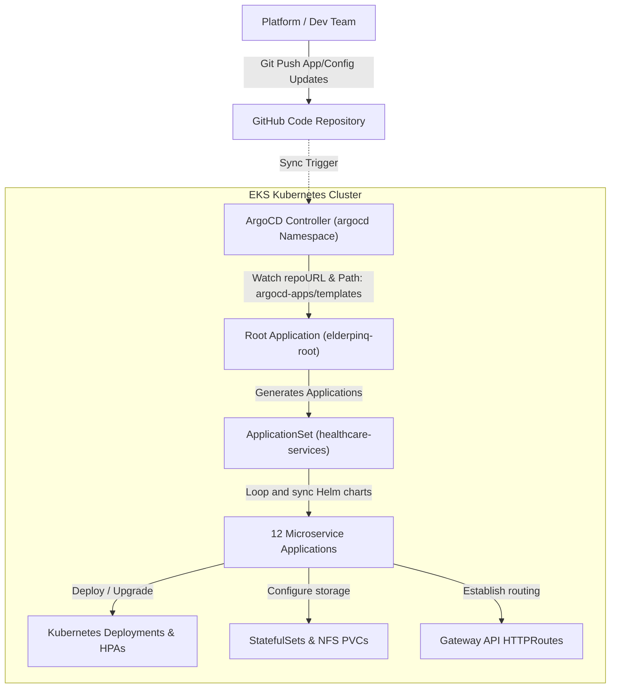
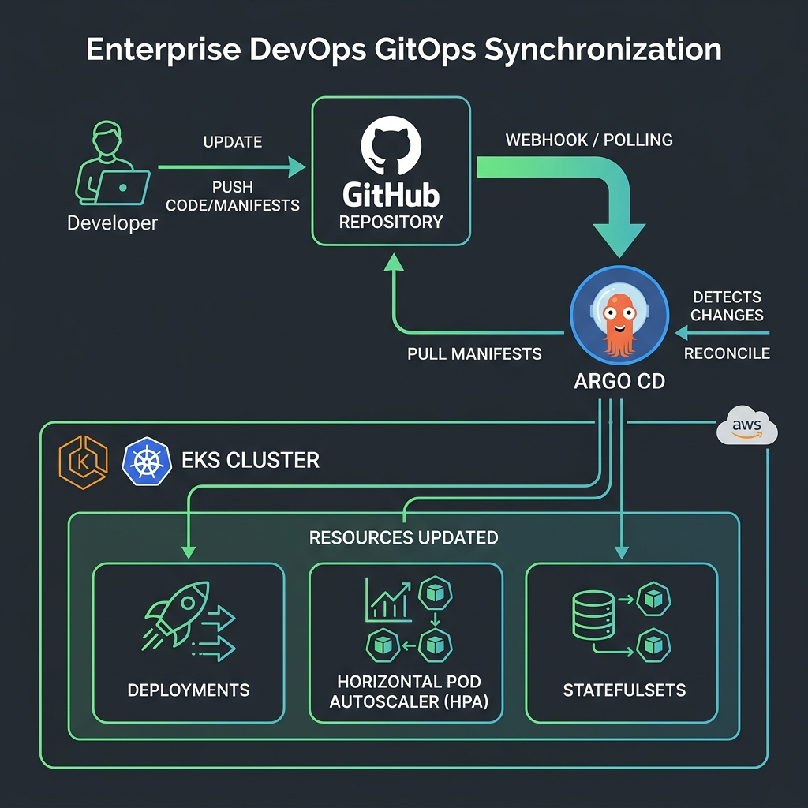

# Kubernetes & GitOps Orchestration Guide ☸️

ElderPing is deployed on Kubernetes (Amazon EKS) using a GitOps model. This guide outlines how resources are managed on the cluster, how external requests are routed to internal pods, how stateful databases utilize NFS dynamic storage, and how ArgoCD automates continuous delivery.

---

## 1. GitOps Synchronization Flow

We utilize the **App-of-Apps** pattern with ArgoCD to manage deployments. The entire cluster state is defined declaratively in the Git repository, allowing ArgoCD to reconcile drift automatically.

> [!NOTE]
> **Diagram Format**: This documentation uses **Mermaid.js** blocks (dynamic text-based flowcharts) that render automatically on GitHub, VS Code (by pressing `Ctrl+Shift+V`), or online markdown readers. A static high-fidelity fallback image is also embedded below.



#### Visual GitOps Sync Flow Diagram:


---

## 2. Ingress, Routing & Load Balancing (KGateway & HAProxy)

In enterprise deployments, traffic routing is layered for security and high availability. ElderPing integrates **HAProxy** with **KGateway (Envoy)**.

### Traffic Entrance Path
1. **DNS Resolution**: Client sends a request to `api.elderping.online`. Route 53 resolves the address to the public IP of the **HAProxy Load Balancer** instance.
2. **External Load Balancing (HAProxy)**: 
   * Active on a dedicated VM or load balancer pool (outside EKS).
   * Listens on ports `80` (HTTP) and `443` (HTTPS).
   * Distributes traffic using a `roundrobin` policy to the **Node IP addresses** of the Kubernetes worker nodes.
   * Target destination port: KGateway's HTTP/HTTPS `NodePort` (e.g., `32080` / `32443`).
3. **Ingress Routing (KGateway)**:
   * **KGateway** is an Envoy-based Kubernetes Gateway API implementation.
   * Inside EKS, a `Gateway` resource defines the entry point inside the `kgateway-system` namespace.
   * KGateway reads custom `HTTPRoute` resources to direct requests based on paths (e.g., routing `/api/auth/*` requests to the `auth-service` ClusterIP Service, and `/` to the `ui-service` frontend pods).

> [!TIP]
> **Why KGateway over Standard Ingress?**
> KGateway implements the modern **Kubernetes Gateway API** specification, which decouples route definitions (`HTTPRoute`) from the physical load balancer infrastructure (`GatewayClass`). This enables cleaner RBAC boundaries: developers own application routing rules, while platform engineers control the global gateway configurations.

---

## 3. Stateful Workloads & NFS Persistent Storage

Because databases are deployed within the cluster during development or hybrid configurations, we must ensure postgres data is preserved across pod restarts.

### Storage Architecture
* **StatefulSets**: Databases (e.g. `auth-db`, `health-db`, `reminder-db`) are deployed as `StatefulSet` resources rather than `Deployments`. This guarantees stable network identifiers and persistent disk mappings (e.g., `auth-db-0` always binds to the same persistent volume).
* **NFS Kernel Server**: An external NFS server hosts the raw Postgres directories (configured at `/srv/nfs/elderping` on the NFS server).
* **Dynamic NFS Provisioner**: EKS deploys the `nfs-subdir-external-provisioner` Helm chart. This creates a `StorageClass` named `nfs-client`.
* **Persistent Volume Claims (PVC)**: When a DB StatefulSet launches, it requests storage via a `VolumeClaimTemplate`. The NFS provisioner automatically mounts a dedicated subdirectory on the NFS export and binds it to a dynamically generated `PersistentVolume (PV)`.

---

## 4. ArgoCD Bootstrap Application Structure

The cluster bootstrap process is initiated using the configuration in `argocd-apps/`:

```
argocd-apps/
├── bootstrap/
│   └── root-application.yaml             # The root app synchronizing all templates
├── templates/
│   ├── namespaces.yaml                   # Core cluster namespaces
│   ├── platform-project.yaml             # ArgoCD Platform Project
│   ├── healthcare-project.yaml           # ArgoCD Application Project
│   ├── security-project.yaml             # ArgoCD Security Project
│   ├── monitoring-project.yaml           # ArgoCD Monitoring Project
│   ├── external-secrets-operator.yaml   # Installs ESO Operator
│   ├── cluster-secret-store-app.yaml     # Binds ECR/Secrets to EKS
│   ├── aws-load-balancer-controller.yaml # Installs AWS ALB Controller
│   ├── prometheus.yaml                   # Installs Prometheus stack
│   ├── grafana.yaml                      # Installs Grafana metrics panels
│   ├── loki.yaml                         # Installs Loki logging stack
│   └── healthcare-services-appset.yaml   # Declares ApplicationSet for microservices
```

### GitOps Sync Order & Waves
We use `argocd.argoproj.io/sync-wave` annotations to control resource creation sequence:

1. **Wave -5 (Namespaces)**: Standard namespaces (`healthcare`, `security`, `monitoring`) are created.
2. **Wave -2 (Operators)**: Operators like the **External Secrets Operator** and **AWS Load Balancer Controller** are installed.
3. **Wave 0 (Platform Configurations)**: Configures global stores like `ClusterSecretStore` and security accounts.
4. **Wave 5 (Observability)**: Deploys Prometheus, Loki, and Grafana to ensure monitoring is active before application startup.
5. **Wave 10 (Application Set)**: The `healthcare-services-appset` triggers. It loops through the 12 microservice names and deploys their Helm charts (`helm/charts/<service-name>`), mapping secrets, configMaps, and auto-scaling rules.

---

## 5. Horizontal Pod Autoscaling (HPA)

To ensure high availability and resource efficiency, every microservice deployment is bound to a `HorizontalPodAutoscaler` resource.

* **Metric Thresholds**: HPAs monitor CPU and memory utilization.
* **Auto-Scaling Rules**: If average CPU utilization exceeds **75%**, or memory usage exceeds **80%** of the pod's declared resource limits, the HPA triggers.
* **Scale-Out**: Scales the pods out (up to a maximum of 10 replicas per service, with a minimum of 2 instances to ensure multi-AZ resilience).
* **Scale-In**: When workload drops, pods are scaled back down gradually after a cooldown period, keeping resource costs minimal.
