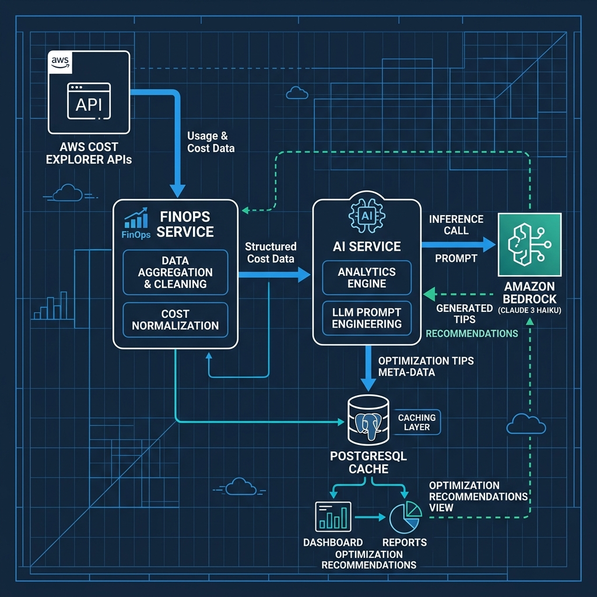

# Observability, Monitoring & FinOps Guide 📊

Maintaining system reliability and cost governance requires visibility into application execution, cluster resource usage, and cloud expenses. This guide details ElderPing's Prometheus-Grafana-Loki observability stack, CloudWatch integration, and the AI-driven FinOps workflow.

---

## 1. Observability Stack (EKS Cluster)

ElderPing implements a standard Kubernetes monitoring stack orchestrated via GitOps sync waves.

### Prometheus Monitoring
* **ServiceMonitors**: Deployed using custom manifests (e.g. `monitoring/prometheus-servicemonitor.yaml`). ServiceMonitors instruct the Prometheus Operator to automatically discover and scrape metrics from pods annotated with specific labels (e.g. `app.kubernetes.io/name`).
* **Scraped Metrics**: Exposes metrics including Express HTTP request durations, database connection pool statistics, memory allocations, and worker execution rates.

### Grafana Visualization
* **Dashboards**: Configured with preloaded JSON models (e.g. [grafana-dashboard.json](file:///d:/documentation/AWS-Elderping/monitoring/grafana-dashboard.json)).
* **Key Visualizations**:
  * Request volumes (HTTP status distributions).
  * Latency quantiles ($p50, p95, p99$).
  * Container memory/CPU utilization against Kubernetes limits.
  * DB connections and thread pools.

### Loki Log Aggregation
* **Loki Stack**: Integrates with Grafana to provide centralized logging.
* **Agent**: Runs Promtail or Fluentbit as a DaemonSet, scraping stdout/stderr logs from all active EKS pods.
* **Log Queries**: Operators can perform regex filters inside Grafana to locate errors (e.g. `failed to parse JWT` or `Bedrock connection error`) across any of the 12 microservices without manually SSHing or running `kubectl logs`.

---

## 2. AWS Native Observability (CloudWatch)

When deploying to AWS, EKS worker logs and custom application metrics are integrated with **Amazon CloudWatch**:

* **CloudWatch Container Insights**: Captures infrastructure metrics from EKS (e.g., node disk utilization, pod CPU limits, network packet rates) for automatic ingestion into CloudWatch metrics.
* **Log Group Retention**: Standardized log group configurations are set up via Terraform with a retention limit of **14 Days** to prevent unbounded storage costs.
* **CloudWatch Alarms**:
  * **System Health Alarms**: Triggered if EKS worker nodes exceed **85%** CPU or memory utilization for more than 5 minutes.
  * **Synthetic Alarms**: Ping the public Load Balancer liveness checks. If a probe fails, an alarm is triggered.
  * **Billing Alarms**: Integrated with AWS Budgets. Sends notifications if estimated monthly AWS costs exceed the budget threshold (e.g., $500).

---

## 3. FinOps & Cost Governance Architecture

In cloud-native systems, billing is a dynamic engineering metric. ElderPing includes active cost governance within its architecture.

> [!NOTE]
> **Diagram Format**: Below is a text flowchart and an embedded high-fidelity visual layout illustrating the data flow.

```
          [AWS Cost Explorer APIs]
                     │
                     ▼ (Monthly Billing Split)
         [finops-service: GET /dashboard]
                     │
                     ▼ (JSON cost payload)
         [ai-service: POST /ai/finops-recs]
                     │
                     ▼ (Prompt optimization payload)
         [Amazon Bedrock (Claude 3 Haiku)]
                     │
                     ▼ (Detailed FinOps Strategy)
         [Cached in finops_db & Displayed on UI]
```

#### Visual cost processing pipeline diagram:


### Dynamic Cost Tracking (`finops-service`)
* **Cost Explorer Integration**: If AWS credentials are set, the service queries the AWS Cost Explorer API (`GetCostAndUsageCommand`) grouped by `SERVICE` dimension over the current monthly billing period.
* **Mock Fallback**: In local development, the service falls back to mock profiles displaying representative costs for EKS ($142.50), RDS ($84.20), Bedrock ($28.10), S3, and CloudWatch.

### AI Cost Optimization Advisor
* **Bedrock Call**: When a super administrator requests optimizations, `finops-service` pulls current cost metrics and triggers a request to `ai-service` at `/ai/finops-recs`.
* **Model Inference**: The `ai-service` formats a Claude 3 Haiku prompt containing the cost metrics and requests actionable recommendations.
* **Actionable Recommendations**: Recommendations include suggestions such as:
  * Consolidating underutilized databases.
  * Scaling down inactive EKS worker nodes during off-peak hours (e.g., 10 PM - 6 AM).
  * Shifting to AWS Aurora Serverless v2.
* **Database Caching**: To prevent unnecessary Bedrock costs, recommendations are cached in the `finops_recommendations` table with status flags indicating if the recommendation has been reviewed or applied.
