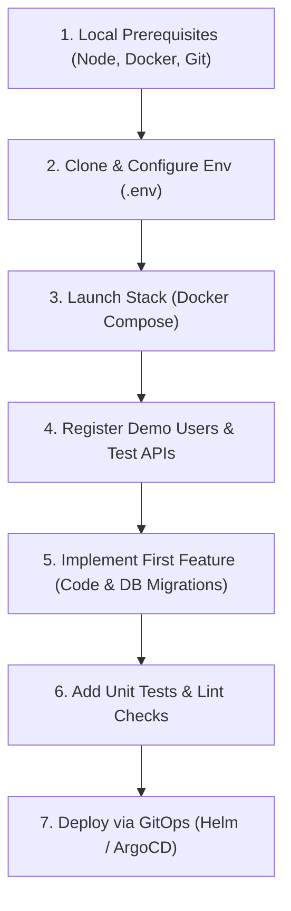

# Developer Onboarding & Step-by-Step Guide 🚀

Welcome to the ElderPing team! If you are a new developer or fresher joining the project, this guide is designed to get your local environment configured, help you understand the codebase patterns, and walk you through implementing your first feature.

---

## 1. Onboarding Roadmap

Below is a conceptual layout showing the path from establishing your local environment to deploying your code changes.



#### Onboarding Pathway:


---

## 2. Local Environment Setup

Follow these steps sequentially to configure your developer workstation:

### Step 1: Install Prerequisites
* **Node.js**: Install Node.js LTS (>= 18.x). Check using `node -v`.
* **Docker Desktop**: Install Docker Desktop (>= 24.x) containing Docker Compose (>= 2.x). Verify with `docker compose version`.
* **Git**: Install Git. Verify with `git --version`.
* **VS Code Extensions (Recommended)**:
  * **Markdown Preview Enhanced** (to preview documentation pages and Mermaid diagrams natively).
  * **Docker** (to inspect running containers).
  * **Prisma** or **SQLTools** (to inspect database tables).

### Step 2: Configure Environment Variables
Copy the root template to create your active `.env` profile:
```bash
cp .env.example .env
```
Open the `.env` file and review the parameters. In local mode, make sure a placeholder secret is defined:
```ini
JWT_SECRET=super_secure_local_development_jwt_secret_key
MOCK_AWS=true
```
Setting `MOCK_AWS=true` disables actual calls to AWS services (Bedrock, S3, SES, SNS, SQS, Cost Explorer) and uses local mock classes instead.

### Step 3: Run the Containers
Spin up the local dockerized services:
```bash
docker compose up --build -d
```
Verify that all 9 containers are running and healthy:
```bash
docker compose ps
```
You should see:
* 5 Node/React containers (`ui-service`, `auth-service`, `health-service`, `reminder-service`, `alert-service`).
* 4 PostgreSQL containers (`auth-db`, `health-db`, `reminder-db`, `alert-db`).

---

## 3. Step-by-Step Guide: Implementing a New API Feature

To help you understand how to write code in this repository, here is a walkthrough to implement a new endpoint in the **Health Tracker Service** (`health-service`) to log a patient's **blood oxygen saturation level (SpO2)**.

### Step A: Update the Database Schema (Migration)
Every microservice owns its database. To add SpO2 tracking, we need to create a database migration.
Create a SQL file inside the migrations folder, e.g., `db-migrations/16_add_spo2_to_health.sql`:

```sql
-- Connect to health_db
\c health_db;

-- Add spo2 column to vitals_logs table
ALTER TABLE vitals_logs ADD COLUMN spo2 NUMERIC(5,2);

-- Add safety constraint (SpO2 percentage must be between 0 and 100)
ALTER TABLE vitals_logs ADD CONSTRAINT check_spo2_range CHECK (spo2 >= 0.0 AND spo2 <= 100.0);
```

### Step B: Update the Express Server Controller
Open the server file `health-service/src/server.js` and locate the `/vitals` insertion route. Modify the endpoint logic to capture SpO2 metrics:

```javascript
// Modify the POST /vitals controller
app.post('/vitals', validateToken, async (req, res) => {
  try {
    const { userId, heartRate, bloodPressure, spo2 } = req.body;
    
    if (!userId || !heartRate || !bloodPressure) {
      return res.status(400).json({ error: 'userId, heartRate, and bloodPressure are required' });
    }

    // Insert the SpO2 parameter into PostgreSQL database
    const result = await pool.query(
      `INSERT INTO vitals_logs (user_id, heart_rate, blood_pressure, spo2, logged_at)
       VALUES ($1, $2, $3, $4, CURRENT_TIMESTAMP) RETURNING *`,
      [userId, heartRate, bloodPressure, spo2 || null]
    );

    // If SpO2 is critically low (< 92%), trigger an internal system alert automatically!
    if (spo2 && spo2 < 92) {
      const alertServiceUrl = process.env.ALERT_SERVICE_URL || 'http://alert-service:3000';
      const fetch = (...args) => import('node-fetch').then(({default: fetch}) => fetch(...args));
      
      await fetch(`${alertServiceUrl}/alerts`, {
        method: 'POST',
        headers: { 
          'Content-Type': 'application/json',
          'Authorization': req.headers.authorization 
        },
        body: JSON.stringify({
          userId: userId,
          alertType: 'CRITICAL_SPO2',
          message: `Critical SpO2 alert logged: ${spo2}%`,
          severity: 'HIGH'
        })
      }).catch(err => console.error('Failed to trigger SpO2 alert notification:', err.message));
    }

    res.status(201).json(result.rows[0]);
  } catch (error) {
    res.status(500).json({ error: error.message });
  }
});
```

### Step C: Secure the Route with Middlewares
Always reuse our security middlewares to protect endpoints:
* **Authentication**: Use `validateToken` (verifies Cognito / local token signature).
* **Role Check**: Use `requireRole(['ADMIN', 'SUPER_ADMIN'])` to restrict access.
* **ABAC Checks**: Use `checkRelationship('userId')` to restrict access between family members and elders.

Example:
```javascript
// Only the elder themselves or their linked family members can view vitals logs
app.get('/vitals/:userId', validateToken, checkRelationship('userId'), async (req, res) => {
  // Controller logic...
});
```

### Step D: Rebuild & Validate Locally
Rebuild the modified `health-service` container:
```bash
docker compose up -d --build health-service
```
Test your new API endpoint using a curl command:
```bash
# Obtain JWT login token first, then:
curl -X POST http://localhost:3002/vitals \
  -H "Content-Type: application/json" \
  -H "Authorization: Bearer <Your_JWT_Token>" \
  -d '{"userId": "1002", "heartRate": 82, "bloodPressure": "120/80", "spo2": 90.5}'
```
Inspect logs to verify the alert logic executed correctly:
```bash
docker compose logs health-service
```

---

## 4. Common Troubleshooting Logs & Fixes

Here are solutions to the most common configuration hurdles encountered by new developers:

### Issue A: "Port 8080 already in use"
* **Symptom**: `docker compose up` fails with a bind socket address error.
* **Cause**: Another local web server (IIS, Apache, or a node process) is listening on port `8888` or `8080`.
* **Fix**: Open `docker-compose.yaml`, locate the `ui-service` ports configuration, and map a separate host port:
  ```yaml
  ports:
    - "9000:80" # Map host port 9000 to container port 80
  ```

### Issue B: Databases Fail to Initialize
* **Symptom**: Service containers exit repeatedly because they cannot establish a PG database connection pool.
* **Cause**: DB initialization scripts in `db-init/` fail due to syntax issues or directory read/write locks on Windows.
* **Fix**: Force database volumes to rebuild completely:
  ```bash
  docker compose down -v
  docker compose up --build -d
  ```

### Issue C: Cognito JWKS Keys Fetch Failure
* **Symptom**: `validateToken` returns `401 Unauthorized` claiming Cognito validation failed, with server logs reporting network connection timeouts.
* **Cause**: The cloud EKS container cannot fetch the JWKS configurations from Cognito User Pools because of missing outbound routing rules or network firewalls.
* **Fix**: Confirm that **VPC PrivateLink Endpoints** are properly assigned for Cognito interface APIs, or check EKS Security Groups outbound egress rules (`0.0.0.0/0` on port `443` must be permitted).
