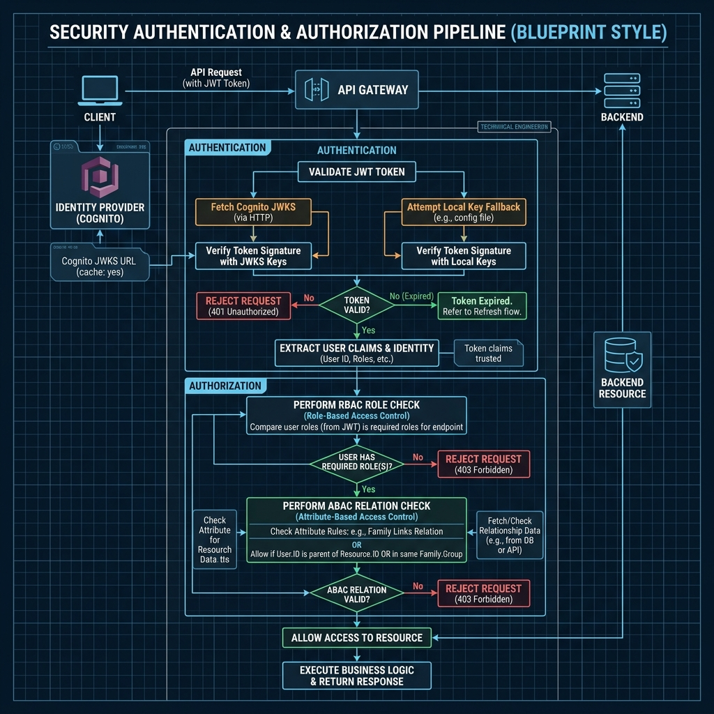

# Security & Compliance Guide 🛡️

ElderPing is designed for sensitive healthcare records, meaning data confidentiality, integrity, and compliance are core design parameters. This document describes the application-level authentication, role boundaries (RBAC/ABAC), infrastructure network isolation, and AWS threat detection capabilities.

---

## 1. Application Authentication (JWT & Cognito)

The authentication middleware ([authMiddleware.js](file:///d:/third-review/ElderPinq/elderping-app/shared/auth/permissions.js)) supports a dual-mode verification flow, making it ideal for both cloud environments and local sandbox developers.

```
                  Client Authorization Header (Bearer <Token>)
                                      │
                                      ▼
                        Is COGNITO_USER_POOL_ID set?
                         /                       \
                       YES                       NO
                       /                           \
       [Cloud Mode: Cognito JWKS]           [Sandbox Mode: Local HMAC]
       - Fetch JWKS keys via URL            - Read local JWT_SECRET
       - Match token 'kid' header           - Verify signature (HS256)
       - Verify RS256 signature             - Decode payload fields
                      \                             /
                       ───────► Context Extracted ◄─
                                      │
                                      ▼
                       req.user populated with:
                       (userId, username, role, email)
```

#### Visual Security Pipeline Diagram:


### Cognito OIDC Validation (Cloud Deployment)
* **Encryption**: Uses **RS256** (Asymmetric key signature validation).
* **JWKS Endpoint**: If the environment variable `COGNITO_USER_POOL_ID` is defined, the middleware constructs a JWKS URI:
  `https://cognito-idp.${awsRegion}.amazonaws.com/${cognitoUserPoolId}/.well-known/jwks.json`
* **Public Key Rotation**: Evaluates the incoming token's header `kid` (Key ID), fetches the matching public key from Cognito's JWKS endpoint, and validates the signature.
* **Claims Mapping**: Maps standard Cognito token claims:
  * `sub` → `userId`
  * `cognito:username` → `username`
  * `custom:role` → `role`

### Local Secret Fallback (Local Development)
* **Encryption**: Uses **HS256** (Symmetric key verification).
* **Validation**: If `COGNITO_USER_POOL_ID` is omitted, the middleware verifies the JWT signature directly using a local secret (`JWT_SECRET`).

---

## 2. Authorization Framework (RBAC & ABAC)

ElderPing separates operations using Role-Based Access Control (RBAC) and Attribute-Based/Relationship-Based Access Control (ABAC).

### Role-Based Access Control (RBAC)
The `requireRole` middleware restricts endpoints to specific application roles:
* **`ELDER`**: Basic user who logs vitals, check-ins, and marks medication compliance.
* **`FAMILY`**: Caregivers linked to a specific elder. Can view vitals, read caregiver notes, and download weekly summaries.
* **`ADMIN`**: Regional operators managing clinic schedules and resolving active alert triggers.
* **`SUPER_ADMIN`**: Platform administrators who can access the audit logs, run cost dashboard queries, and manage database configurations.

### Attribute/Relationship-Based Access Control (ABAC)
Because family members should only access their own relative's vitals and alerts, ElderPing enforces strict relationship validation via the `checkRelationship` middleware:

1. **Elder Boundary**: If the caller has the `ELDER` role, the middleware validates that the requested `elderId` matches their own token `userId`. Elders cannot access other elders' logs.
2. **Family Boundary**: If the caller has the `FAMILY` role, the middleware queries the `family_links` database (either directly in `users_db` or via a REST call to `auth-service` at `/links/verify/:familyId/:elderId`). If the relationship is not verified, the request is rejected with a `403 Forbidden` status.
3. **Admin Override**: Operators with `ADMIN` or `SUPER_ADMIN` roles bypass ABAC checks to support system triage.

---

## 3. Network Isolation & Infrastructure Security

AWS resources are protected using multi-layered security controls:

* **Subnet Security**: All microservices and databases run inside private subnets. They do not have public IP addresses and cannot receive traffic directly from the internet.
* **Gateways and ALB**: Incoming API traffic must pass through the Application Load Balancer, which is bound to the public subnets.
* **Security Groups**: 
  * The ALB security group only allows ingress traffic on ports `80` and `443` from specified external CIDRs.
  * The EKS node security groups only allow ingress traffic from the ALB security group.
  * The RDS database security group restricts ingress to the EKS worker node security group on port `5432`.
* **AWS WAFv2**: Associated with the ALB. Filters malicious traffic, inspects header patterns, blocks known scanner bots, and shields the cluster from Distributed Denial of Service (DDoS) attempts.
* **VPC Endpoints (PrivateLink)**: Eliminates the requirement to route requests to AWS APIs (like Bedrock, S3, or Cognito) over the public internet, keeping raw payload traffic entirely within the private network boundaries.

---

## 4. Threat Detection & Compliance Tools

Enterprise deployments include AWS native security monitoring:

| Service | Category | Specific Purpose in ElderPing |
| :--- | :--- | :--- |
| **AWS CloudTrail** | Audit Trails | Records all AWS API operations across the entire AWS account (e.g. database configuration changes, IAM role updates, EKS cluster accesses) for post-incident audits. |
| **AWS GuardDuty** | Threat Detection | Continuously monitors CloudTrail, VPC Flow Logs, and DNS queries using machine learning to detect anomalies (e.g., unauthorized EC2 communication, brute-force attacks, EKS pod privilege escalations). |
| **AWS Security Hub** | Security Posture | Consolidated security panel. Regularly evaluates infrastructure against industry benchmarks (CIS AWS Foundations, PCI-DSS) to flag configuration drift and vulnerabilities. |
| **Amazon Inspector** | Vulnerability Scanning | Scans ECR container registries for package vulnerabilities and reviews EKS node images to locate outstanding security patches. |
| **AWS Config** | Compliance Compliance | Audits, evaluates, and tracks configuration histories for all AWS resource changes to ensure security policies are maintained over time. |
